<div align="center">

# Testora

**Aplikasaun mobile ba ezame online ne'ebe seguru, tempu-real, no suporta papel oioin ba eskola.**


</div>

---

## Kona-ba Projetu

**Testora** mak aplikasaun mobile Flutter ba jere ezame online. Sistema ne'e dezenvolve atu ajuda administrador, mestre, no estudante atu halo prosesu ezame iha fatin ida.

- Administrador bele jere uzuariu, materia, ezame ne'ebe mestre haruka, relatoriu, no alerta.
- Mestre bele kria ezame ba materia ne'ebe administrador atribui, jere pergunta, haree estudante, no haree rezultadu.
- Estudante bele haree ezame ne'ebe publika ona, tuir ezame iha tempu ne'ebe determina, haree istoria, no simu alerta.

Testora uza Firebase ba autentikasaun no dadus tempu-real, OneSignal ba notifikasaun push, no interface suporta **Tetun** no **Ingles**.

## Teknolojia ne'ebe Uza

| Kategoria | Teknolojia | Funsaun |
| --- | --- | --- |
| Estrutura Mobile | Flutter | Interface mobile ba plataforma barak |
| Linguajen | Dart | Logika aplikasaun |
| Autentikasaun | Firebase Authentication | Login Google no email/password |
| Baze Dadus | Cloud Firestore | Dadus tempu-real ba uzuariu, materia, ezame, rezultadu, alerta |
| Rai Ficheiru | Firebase Storage | Rai imajen pergunta |
| Jere State | Flutter Riverpod | Provider, state tempu-real, no preferensia aplikasaun |
| Navigasaun | GoRouter | Navigasaun tuir papel uzuariu |
| Notifikasaun Push | OneSignal | Notifikasaun ba administrador, mestre, no estudante |
| Tradusaun | Easy Localization | Lingua Tetun no Ingles |
| PDF | pdf + printing | Export relatoriu rezultadu |
| Hili Media | image_picker | Upload imajen ba pergunta |

## Funsaun Prinsipal

### Papel Administrador

- Jere uzuariu ho filtru papel: administrador, mestre, estudante, no uzuariu foun.
- Jere materia, atribui mestre ida ba materia ida, no atribui estudante barak ba materia.
- Haree ezame ne'ebe mestre haruka ho status `sending`.
- Publika ezame depois valida jadwal atu la kontra malu ho ezame seluk.
- Haree dashboard ho total estudante, mestre, materia, rezultadu, no atividade semanal.
- Haree relatoriu ho filtru materia, ezame, estudante, no export ba PDF.
- Simu alerta bainhira mestre haruka ezame atu publika.

### Papel Mestre

- Hili materia ativa iha pajina perfil.
- Kria ezame ba materia ne'ebe administrador atribui.
- Jere pergunta ho suporta imajen.
- Haruka ezame ba administrador atu publika.
- Haree estudante ne'ebe atribui ba materia.
- Haree rezultadu ezame ne'ebe remata, orden husi pontu aas ba pontu kiik.
- Simu alerta bainhira ezame publika ka hahu ona.

### Papel Estudante

- Hili materia ativa iha pajina perfil.
- Haree ezame ne'ebe publika ona no seidauk remata.
- Tuir ezame ho konta tun tempu-real.
- Labele halo ezame rua dala se ezame ida remata ona.
- Haree istoria rezultadu.
- Simu alerta bainhira ezame atu hahu ka hahu ona.

## Fluxu Ezame

```mermaid
flowchart LR
    A[Mestre kria ezame] --> B[Draft]
    B --> C[Haruka ba administrador]
    C --> D[Sending]
    D --> E[Administrador valida jadwal]
    E --> F[Publika]
    F --> G[Estudante simu alerta]
    G --> H[Estudante tuir ezame]
    H --> I[Rezultadu]
    I --> J[Ezame remata / Done]
```



## Estrutura Projetu

```text
lib/
|-- core/
|   |-- routes/          # GoRouter no guarda tuir papel
|   |-- themes/          # Mode roman no mode nakukun
|   |-- providers/       # Preferensia global
|   `-- widgets/         # Scaffold global
|-- features/
|   |-- admin/           # Painel, uzuariu, materia, ezame, relatoriu
|   |-- alerts/          # Alerta tempu-real no notifikasaun push
|   |-- auth/            # Login, Google Sign-In, validasaun papel
|   |-- exam/            # Lista ezame, tuir ezame, rezultadu estudante
|   |-- history/         # Istoria estudante
|   |-- professor/       # Mestre dashboard, ezame, pergunta, rezultadu
|   |-- profile/         # Perfil, lingua, mode nakukun, materia ativa
|   `-- splash/          # Splash screen no redirect inisial
|-- shared/
|   |-- models/          # Uzuariu, Materia, Ezame, Pergunta, Rezultadu, Alerta
|   |-- services/        # OneSignal no ajudante baze dadus
|   `-- widgets/         # Butaun, kampu testu, loading overlay
`-- main.dart            # Pontu tama aplikasaun
```

## Koleksaun Firestore

| Koleksaun | Deskrisaun |
| --- | --- |
| `users` | Perfil uzuariu, papel, lingua, mode nakukun, materia ativa, OneSignal id |
| `subjects` | Materia, mestre ne'ebe atribui, estudante ne'ebe atribui |
| `exams` | Ezame, jadwal, status, materia, durasaun |
| `questions` | Pergunta ezame, opsaun, resposta loos, imajen |
| `user_exam_results` | Rezultadu estudante ba ezame |
| `alerts` | Alerta tempu-real ba administrador, mestre, no estudante |

## Status Ezame

| Status | Signifikadu |
| --- | --- |
| `draft` | Mestre seidauk haruka ba administrador |
| `sending` | Mestre haruka ona, hein administrador atu publika |
| `published` | Administrador publika ona, estudante bele asesu tuir jadwal |
| `done` | Ezame remata ona |

## Requisitu

- Flutter SDK
- Dart SDK
- Firebase CLI
- Projetu Firebase ho Authentication, Firestore, no Storage
- Android Studio ka device Android ba testing
- OneSignal App ID no API key ba notifikasaun push

## Oinsa Halai iha Lokal

1. Instala dependensia:

```bash
flutter pub get
```

2. Konfigura Firebase se presiza:

```bash
flutterfire configure --project=testora-ee95f
```

3. Halai aplikasaun:

```bash
flutter run
```

4. Deploy Firestore rules no indexes:

```bash
firebase deploy --only firestore:rules,firestore:indexes --project testora-ee95f
```

## Komandu Util

```bash
flutter analyze --no-pub
dart format lib
flutter pub get
flutter clean
```

## Lingua no Tema

Testora suporta:

- **Tetun**: lingua principal ba interface.
- **Ingles**: lingua alternativa.
- **Mode Nakukun**: tema nakukun ba interface.

Preferensia lingua, tema, no materia ativa rai iha Firestore no halo rebuild iha aplikasaun sem splash screen.

## Notifikasaun Push

Notifikasaun push uza **OneSignal** no funciona ba:

- Administrador simu alerta bainhira mestre haruka ezame atu publika.
- Mestre no estudante simu alerta bainhira ezame publika.
- Mestre no estudante simu alerta bainhira ezame hahu.
- Uzuariu simu notifikasaun push se iha alerta foun ne'ebe seidauk lee.

## Seguransa no Akses

- Email foun bele login ho Google, maibe sei hetan status pending se seidauk iha papel.
- Administrador mak determina papel no atribui materia.
- Mestre bele haree no jere dadus ba materia ne'ebe atribui deit.
- Estudante bele haree ezame, rezultadu, no alerta ba materia ne'ebe atribui deit.
- Administrador bele jere plataforma tomak.

## Planu ba Oin

- Hadia UI detail ba tablet.
- Aumenta analiza dadus ba administrador.
- Aumenta export relatoriu ho modelu eskola.
- Aumenta teste automatizadu ba fluxo ezame.

## Licensa

Projetu ida ne'e dezenvolve ba nesesidade akademika no edukasaun digital. Ajusta licensa tuir politika instituisaun ka ekipa dezenvolvimentu.

---

<div align="center">

**Testora - Ezame online seguru, justu, no fasil atu uza.**

</div>
