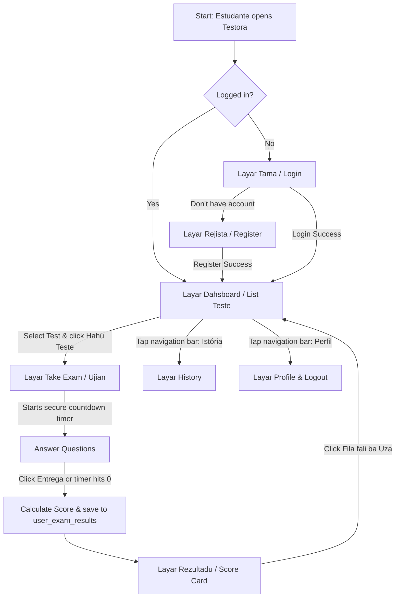

# Testora - Workflow & Wireframe Guide (Student Client)

This document provides a clear explanation of how the data flows, who creates the questions, and the visual screen structures (wireframes) of the **Testora Online Exam Application**.

---

## 👥 1. Who Creates the Questions & Exams?

In the Testora ecosystem, there are two distinct user roles:

1. **Administradór / Mestre (Admin / Teacher)**:
   - **Responsibility**: Creates, updates, and activates/deactivates exams and questions.
   - **How it works (MVP)**: Currently, the admin inputs exams directly into the **Firebase Console (Cloud Firestore)** or uses the developer seeding button we built inside the app's home dashboard (`Seed Teste Dummy (Dev)`).
   - **Production Phase**: In a future phase, a web-based Admin Panel or Teacher portal can be created to allow non-technical teachers to add questions easily without opening the Firebase Console.

2. **Estudante (Student / Client)**:
   - **Responsibility**: Logs in, views available tests, takes the exam within the allowed time limit, and reviews past attempts.
   - **This App**: The app we built is the **Estudante client**, designed specifically for students to take tests securely.

---

## 🔄 2. Application Workflow (Alur Kerja)

The user journey is fully automated using Firebase:

---

## 📱 3. Wireframes & Screen Layout Structure

Here is how each screen is laid out visually:

### Screen A: Tama (Login Screen)
- **Header**: Icon `Icons.school_rounded` + Title "Testora".
- **Form Card**:
  - Email Field
  - Password Field (with visibility toggler Eye-icon)
  - Primary button: "Tama"
- **Footer**: Link button "Seida'uk iha konta? Rejista iha ne'e" to navigate to the Register Screen.

### Screen B: Rejista (Register Screen)
- **Header**: Left back arrow + Title "Rejista".
- **Form Card**:
  - Name Field ("Naran Kompletu")
  - School Field ("Eskola / Universidade")
  - Email Field
  - Password Field
  - Primary button: "Rejista"

### Screen C: Dashboard (List Exam Screen)
- **Header**: Title "Testora" + Profile Icon on the right.
- **Top Banner**: Blue gradient card welcoming the student: "Olá, [Naran]! - [Eskola]".
- **List Area**: Dynamic cards showing:
  - Category Badge (e.g. "Lian Tetun")
  - Duration Badge (e.g. "5 Minutu")
  - Exam Title & Description
  - Number of questions (e.g. "3 Soal")
  - Primary button: "Hahú Teste"
- **Bottom Navigation**: 3 Tabs (`Dashboard`, `Istória`, `Perfil`).

### Screen D: Take Exam Screen
- **Header**: Time Remaining Timer (e.g. "04:59") with alarm icon.
- **Top**: Horizontal progress bar showing answered vs total questions.
- **Body Card**:
  - Question title (e.g. "Pergunta 1 husi 3")
  - Main question text
  - Multiple choice grid (A, B, C, D radio options)
- **Footer Navigation**:
  - Left button: "Kotuk" (Previous Question)
  - Right button: "Oin" (Next Question) / "Entrega" (Submit) on the last question.

### Screen E: Result Screen
- **Header**: Title "Rezultadu".
- **Body**:
  - Circular indicator showing percentage score (e.g. `100.0%`).
  - Color-coded text: "Parabéns, Ita-boot Pasadu!" (Success) or "Koko fali, ita-boot labele desistir!" (Fail).
  - Summary grid (Total questions, Correct answers, Incorrect answers, Time taken).
- **Footer**: Button "Fila fali ba Uma" to return to the Dashboard.

### Screen F: Istória (History Screen)
- **Header**: Title "Istória".
- **List Area**: A stream of attempt cards showing:
  - Test title
  - Date submitted
  - Percent badge (Green background if score >= 60%, Red if score < 60%)
  - Duration taken (e.g., "Time: 45 Segundu").
